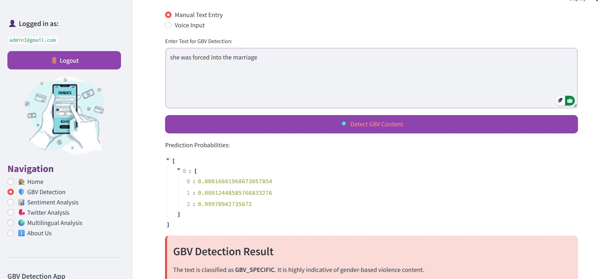
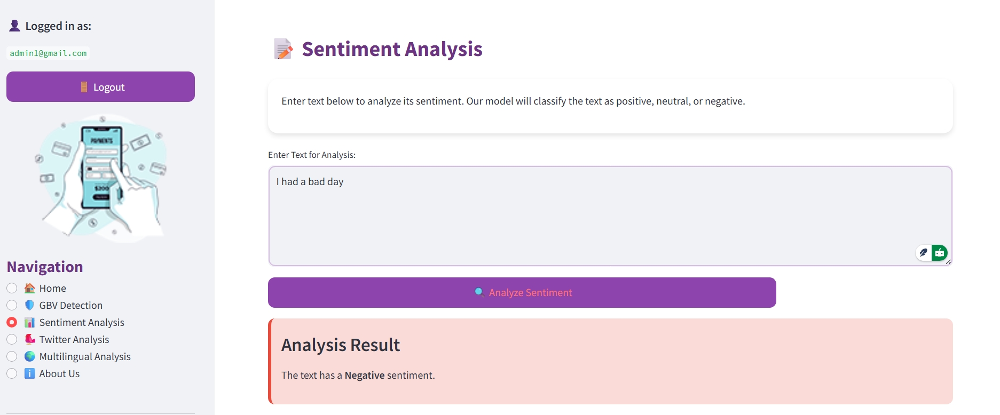

# 🛡️ Gender-Based Violence (GBV) Detection & Sentiment Analysis App

**A powerful real-time web app that detects violent, offensive, or non-violent language using fine-tuned BERT models. Built with 💻 Streamlit, 🤗 Transformers, 🧠 PyTorch, and ☁️ Supabase.**

---

## 🚀 Live Demo

> 💡 Note: Due to model size constraints (400MB+), this app is currently run locally. Deployment via Hugging Face or cloud storage is in progress.

---

## 📌 Features

- 🔍 **GBV Detection**: Classifies text into `NON_VIOLENT`, `OFFENSIVE_NOT_GBV`, or `GBV_SPECIFIC`
- 📊 **Sentiment Analysis**: Supports multilingual sentiment detection
- 🎙️ **Voice Input**: Speak your text instead of typing
- 🐦 **Twitter Analysis**: Fetch tweets by keyword and analyze for GBV & sentiment
- 📄 **PDF Reports**: Download detailed analysis reports
- ☁️ **Supabase Integration**: User login, registration, and storage management

---

## 🖼️ Screenshots

| GBV Detection | Sentiment Analysis |
|---------------|--------------------|
|  |  |


---

## 🛠️ Tech Stack

| Tool | Purpose |
|------|---------|
| [Streamlit](https://streamlit.io/) | Frontend Web App |
| [PyTorch](https://pytorch.org/) | Model Inference |
| [Transformers](https://huggingface.co/transformers/) | BERT & mBERT Models |
| [Supabase](https://supabase.io/) | Auth & Storage |
| [FPDF](https://pyfpdf.github.io/fpdf2/) | Report Generation |
| [SpeechRecognition](https://pypi.org/project/SpeechRecognition/) | Voice Input |

---

## ⚙️ Installation (Run Locally)

1. **Clone this repo**
   ```bash
   git clone https://github.com/prachi-madane14/gbv-classifier.git
   cd gbv-classifier
